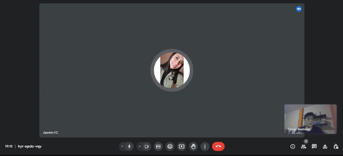
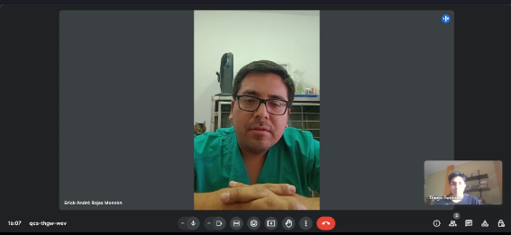
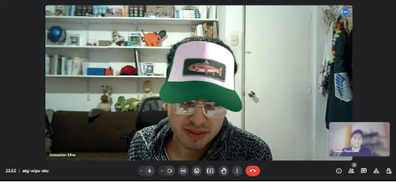
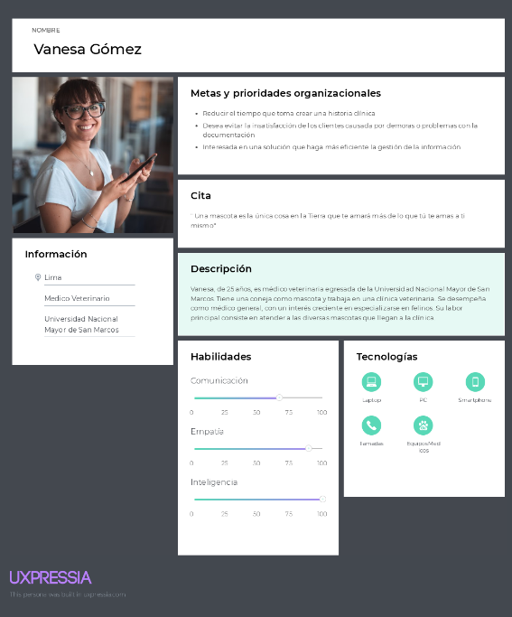
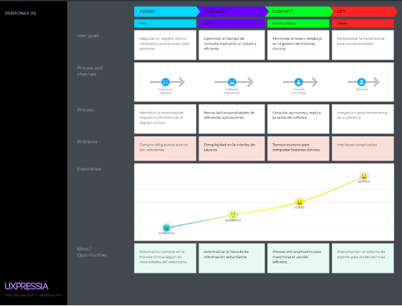
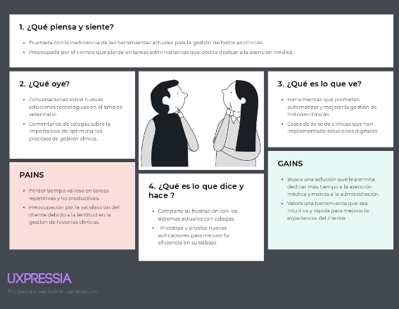
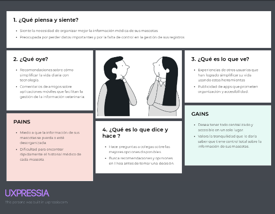

# **2. Capítulo II: Requirements Elicitation & Analysis**
   ## **2.1. Competidores**
**VetPraxis:** Es una solución de gestión para clínicas veterinarias, creada para mejorar la administración de las operaciones diarias. La aplicación incluye funcionalidades como la gestión de citas, historiales clínicos electrónicos, control de inventario y facturación. Además, ofrece herramientas para facilitar la comunicación con los clientes y el seguimiento de los tratamientos.

**VetApp:** Es una plataforma creada para gestionar clínicas veterinarias. Ofrece funciones como la programación de citas, la gestión de historiales clínicos electrónicos y la administración del inventario.

**PetClinic:** Es una aplicación desarrollada para la gestión de clínicas veterinarias y consultas para mascotas. Ofrece funciones para programar citas, gestionar historiales clínicos electrónicos, y administrar inventarios y facturación. La plataforma está diseñada para mejorar la organización y eficiencia en las clínicas, proporcionando herramientas para el seguimiento de tratamientos y la comunicación con los clientes. PetClinic está especialmente adaptada a las necesidades del sector veterinario en Perú.
### **2.1.1. Análisis Competitivo** 

<table><tr><th colspan="6" valign="top"><b>Competitive Analysis Landscape</b></th></tr>
<tr><td rowspan="2" valign="top"><b>¿Por qué llevar a cabo este análisis?</b></td><td colspan="5" valign="top">Escriba en el recuadro la pregunta que busca responder o el objetivo de este análisis.</td></tr>
<tr><td colspan="5" valign="top">Para comparar las características tanto internas como externas de los productos que compiten con nosotros.</td></tr>
<tr><td colspan="2" valign="top">(En la cabecera colocar por cada competidor nombre y logo)</td><td>Ez.vet</td><td>VetPraxis</td><td>VetApp</td><td>PetClinic</td></tr>
<tr><td rowspan="2"><b>Perfil</b></td><td><b>Overview</b></td><td>Plataforma para clínicas veterinarias que facilita la gestión de historiales clínicos, recordatorios e inventarios mediante una interfaz intuitiva y sencilla de usar.</td><td>Software de gestión veterinaria que mejora la administración de citas, historiales clínicos y facturación a través de una interfaz amigable.</td><td>Aplicación móvil para la gestión de citas, recordatorios e historiales médicos de mascotas, que facilita la comunicación entre veterinarios y propietarios.</td><td>Plataforma que combina la administración de historiales clínicos, citas e inventario para optimizar la eficiencia en clínicas veterinarias.</td></tr>
<tr><td valign="top"><b>Ventaja competitiva ¿Qué valor ofrece a los clientes?</b></td><td>Interfaz fácil de usar que simplifica la gestión de historiales, recordatorios e inventarios.</td><td>Administración completa de citas, historiales y facturación mediante una interfaz amigable.</td><td>Gestión móvil de citas e historiales médicos que optimiza la comunicación entre veterinarios y propietarios.</td><td>Plataforma integral para gestionar historiales, citas e inventario en clínicas veterinarias.</td></tr>
<tr><td rowspan="2"><b>Perfil de Marketing</b></td><td valign="top"><b>Mercado objetivo</b></td><td>Clínicas veterinarias y dueños de mascotas</td><td>Clínicas veterinarias medianas y grandes</td><td>Propietarios de mascotas y veterinarios móviles</td><td>Clínicas veterinarias pequeñas y medianas</td></tr>
<tr><td valign="top"><b>Estrategias de marketing</b></td><td>Redes sociales y asociaciones con clínicas.</td><td>Estrategias de marketing de contenido y seminarios web.</td><td>Redes sociales</td><td>Publicidad dirigida y promociones</td></tr>
<tr><td rowspan="3"><b>Perfil de Producto</b></td><td valign="top"><b>Productos & Servicios</b></td><td>Administración de historiales clínicos, recordatorios e inventarios.</td><td>Gestión de citas, historiales clínicos y facturación</td><td>Aplicación móvil para gestionar citas e historiales médicos</td><td>Plataforma para administración de historiales, citas e inventario</td></tr>
<tr><td valign="top"><b>Precios & Costos</b></td><td>Suscripción mensual con diferentes niveles</td><td>Licencia de software con tarifas anuales</td><td>Descarga gratuita con compras dentro de la app</td><td>Suscripción con tarifas basadas en el tamaño de la clínica</td></tr>
<tr><td valign="top"><b>Canales de distribución (Web y/o Móvil)</b></td><td>Web y móvil</td><td>Web</td><td>Móvil (App stores)</td><td>Web</td></tr>
<tr><td rowspan="5"><b>Análisis SWOT</b></td><td colspan="5" valign="top">Realice esto para su startup y sus competidores. Sus fortalezas deberían apoyar sus oportunidades y contribuir a lo que ustedes definen como su posible ventaja competitiva.</td></tr>
<tr><td><b>Fortalezas</b></td><td>Interfaz intuitiva y fácil de usar; integración de múltiples funciones</td><td>Gestión integral y amigable; adaptado para clínicas medianas y grandes</td><td>Acceso móvil conveniente; mejora la comunicación con propietarios de mascotas</td><td>Plataforma integral para clínicas pequeñas y medianas; fácil de usar</td></tr>
<tr><td><b>Debilidades</b></td><td>Dependencia de la adopción por parte de clínicas veterinarias</td><td>Costos potencialmente altos para pequeñas clínicas</td><td>Funcionalidades limitadas comparadas con plataformas completas</td><td>Limitado a clínicas de menor tamaño; menos atractivo para grandes clínicas</td></tr>
<tr><td><b>Oportunidades</b></td><td>Expansión en el mercado de clínicas veterinarias pequeñas y medianas</td><td>Crecimiento en el segmento de clínicas grandes y asociaciones veterinarias</td><td>Expansión en el mercado de usuarios móviles y propietarios de mascotas</td><td>Penetración en el mercado de clínicas veterinarias pequeñas</td></tr>
<tr><td><b>Amenazas</b></td><td>Competencia de otras plataformas con características similares</td><td>Competencia con soluciones de bajo costo o gratuitas</td><td>Alta competencia en aplicaciones móviles para la salud de mascotas</td><td>Competencia de soluciones más avanzadas para clínicas grandes</td></tr>
</table>

### **2.1.2. Estrategias y tácticas frente a competidores**

Estrategias: 

Para destacar en el mercado, Ez.vet se enfocará en ofrecer una interfaz excepcionalmente intuitiva y fácil de usar, diferenciándose de las soluciones más complejas y difíciles de manejar. Además, se distinguirá por su valor añadido al incluir características exclusivas, como la personalización de historiales clínicos y recordatorios adaptados a las necesidades particulares de cada clínica y propietario de mascotas.

Tácticas: 

- Se llevarán a cabo demostraciones personalizadas en clínicas veterinarias para mostrar de forma práctica las ventajas de la plataforma. Asimismo, se ofrecerán períodos de prueba gratuita para que los usuarios puedan experimentar los beneficios de Ez.vet sin ningún compromiso.

- Se recogerán y publicarán testimonios y casos de éxito de usuarios satisfechos que hayan logrado mejoras significativas en la gestión veterinaria. Estos testimonios se emplearán en campañas de marketing y en el sitio web de la aplicación para fortalecer la credibilidad y atraer nuevos clientes.

## **2.2. Entrevistas**
   ### **2.2.1. Diseño de Entrevistas**
  ***Segmento 1: Médicos Veterinarios***

1. ¿Conoces alguna aplicación de gestión veterinaria? ¿Cuál es?
1. ¿Lo escogieron por alguna razón es especial?
1. ¿Fue la primera aplicación que usaron?
1. ¿Qué es lo que te gusta de esa aplicación?
1. ¿Qué te disgusta de esa aplicación?
1. ¿Qué sería una de las cosas que si o si cambiarias?

***Segmento 2: Dueños de Mascotas***

1. ¿Con que frecuencia vas al veterinario?
1. ¿Qué método usas para llevar el control de tu mascota?
1. ¿Alguna vez perdiste los documentos?
1. ¿En medio de algún tratamiento cambiaste de veterinario?
1. ¿Qué opinas de tener la historia clínica en una aplicación?
1. ¿Usarías una aplicación como la descrita?
### **2.2.2. Registro de entrevistas**
   ***Segmento 1: Médicos Veterinarios***

   **Entrevistado N°1: Jasmin Flores**

- **Sexo: Femenino** 
- **Edad: 26**
- **Domicilio: San Miguel** 

**Entrevista:** 

- **Link: <https://upcedupe-my.sharepoint.com/:v:/g/personal/u20221a301_upc_edu_pe/EQ-ZYy2RvYpNgt1Qfy9tHTUByB1wTz3kGVrQscVWHWam9A?nav=eyJyZWZlcnJhbEluZm8iOnsicmVmZXJyYWxBcHAiOiJPbmVEcml2ZUZvckJ1c2luZXNzIiwicmVmZXJyYWxBcHBQbGF0Zm9ybSI6IldlYiIsInJlZmVycmFsTW9kZSI6InZpZXciLCJyZWZlcnJhbFZpZXciOiJNeUZpbGVzTGlua0NvcHkifX0&e=j1mdQ7>** 
- **Momento en el que Inicia: 0:00 min**
- **Duración: 4:49 min**

**Resumen:**

La doctora Jasmín nos comenta que en la veterinaria donde trabaja, solo tienen un usuario que se puede abrir en varios dispositivos para completar las historias clínicas. Lo que le agrada de esta aplicación es que está diseñada específicamente para el trabajo en veterinarias, con campos adaptados a cada especie o raza. Sin embargo, lo que no le gusta es que, aunque algunos campos no son obligatorios, tener que pasarlos para completar la historia clínica toma más tiempo del que desearía.

**Entrevistado N°2: Erick Monzón**

- **Sexo: Masculino** 
- **Edad: 30**
- **Domicilio: Magdalena del Mar** 

**Entrevista:** 

- **Link: <https://upcedupe-my.sharepoint.com/:v:/g/personal/u20221a301_upc_edu_pe/EbCW9J6OzTFKoDAHzGbfWzEBpDcpUG7M16WiUuDkC7iPMA>** 
- **Momento en el que Inicia: 0:00 min**
- **Duración: 6:22 min**

**Resumen:**

El Doctor Erick nos comenta que en su trabajo utilizan VetPraxis, principalmente porque es una aplicación muy reconocida y muchas veterinarias la emplean. Sin embargo, señala que tiene ciertas deficiencias, especialmente en lo que respecta a la eficiencia. Una de las principales críticas que hace es la inclusión de numerosos campos obligatorios que considera innecesarios, como el teléfono de trabajo, RUC, enlaces a redes sociales como Facebook e Instagram, y otros detalles que realmente no son relevantes para la atención al cliente. Esto se traduce en un proceso de creación de historias clínicas que puede tomar entre 7 y 10 minutos, un tiempo excesivo, especialmente en situaciones de emergencia donde la rapidez es crucial. Erick enfatiza que uno de los cambios que realizaría de manera prioritaria sería la eliminación de estos campos superfluos, para agilizar el proceso y hacer la aplicación más eficiente.  

**Entrevistado N°3: Vanesa Gómez** 

- **Sexo: Femenino**
- **Edad: 25**
- **Domicilio: Lince** 

**Entrevista:** 

- **Link: <https://upcedupe-my.sharepoint.com/:v:/g/personal/u20221a301_upc_edu_pe/EYY7QpIHFxlDh0ksAmySO-kB1yHNDLGTJPHi61WTR0jlWg?nav=eyJyZWZlcnJhbEluZm8iOnsicmVmZXJyYWxBcHAiOiJPbmVEcml2ZUZvckJ1c2luZXNzIiwicmVmZXJyYWxBcHBQbGF0Zm9ybSI6IldlYiIsInJlZmVycmFsTW9kZSI6InZpZXciLCJyZWZlcnJhbFZpZXciOiJNeUZpbGVzTGlua0NvcHkifX0&e=JeOE4m>** 
- **Momento en el que Inicia:**
- **Duración: 6:58 min**

**Resumen:**

La doctora Vanesa comenta que en su trabajo actual utilizan VetPraxis, principalmente porque es la aplicación más conocida entre las veterinarias. Sin embargo, en su trabajo anterior, usaban fichas en papel, que luego archivaban en un Excel donde guardaban el número de historia clínica y el nombre de la mascota para facilitar la búsqueda posterior. Al igual que el doctor Erick, Vanesa no está satisfecha con los campos innecesarios que VetPraxis requiere, ya que le toma entre 10 y 15 minutos crear una historia clínica, lo cual considera excesivo. En su anterior trabajo, también encontraba ineficiente el método físico, ya que la letra a veces no era legible o las historias se traspapelaban, lo que causaba molestias a los clientes. Vanesa cambiaría estos campos innecesarios que ralentizan el proceso de creación de historias clínicas en VetPraxis.

***Segmento 2: Dueños de Mascotas***

**Entrevistado N°1: Sebastián Silva**

- **Sexo: Masculino**
- **Edad: 20**
- **Domicilio: San Luis** 

**Entrevista:** 

- **Link: <https://upcedupe-my.sharepoint.com/:v:/g/personal/u20221a301_upc_edu_pe/Ec1XInM48xNOvR2jbzHkwuABf9CG5aosdZClZOwqh0nyYw>** 
- **Momento en el que Inicia: 0:00 min**
- **Duración: 6:58 min**

**Resumen:**

`	`Sebastián nos comenta que lleva a su mascota al veterinario entre una y dos veces al año, aunque si su gato presentara algún malestar, lo llevaría con mayor frecuencia. Con su perro, solía ir una vez a la semana debido a una infección en el oído. Sebastián mencionó que no recuerda dónde dejó la carpeta con toda la documentación médica de su mascota y que le gustaría tener una aplicación donde pudiera almacenar todo el historial médico de sus mascotas. De esta manera, podría actuar más rápidamente en caso de una emergencia, ya que tendría la información disponible en su celular. A pesar de esto, seguiría utilizando el formato físico como respaldo para no perder ningún registro de las atenciones a sus mascotas.

**Entrevistado N°2: Lucerito Guzmán**

- **Sexo: Femenino** 
- **Edad: 22 años**
- **Domicilio: Callao**

**Entrevista:** 

- **Link: <https://upcedupe-my.sharepoint.com/:v:/g/personal/u20221a301_upc_edu_pe/EQxyGm-xOy9Gixk9iwdU5-4B7_sjaOllyMTn6QX3f6py1Q?nav=eyJyZWZlcnJhbEluZm8iOnsicmVmZXJyYWxBcHAiOiJPbmVEcml2ZUZvckJ1c2luZXNzIiwicmVmZXJyYWxBcHBQbGF0Zm9ybSI6IldlYiIsInJlZmVycmFsTW9kZSI6InZpZXciLCJyZWZlcnJhbFZpZXciOiJNeUZpbGVzTGlua0NvcHkifX0&e=aOWtoD>** 
- **Momento en el que Inicia: 0:00 min**
- **Duración: 7:10 min**	

**Resumen:**

`	`Lucerito nos comenta que visita al veterinario con bastante regularidad: una vez cada tres meses por su gata pequeña y una vez al mes para bañar a su perra. Ha tenido problemas con la pérdida de cartillas de vacunación, exámenes y otros documentos relacionados con sus gatas adultas. Además, ha cambiado de veterinaria en dos o tres ocasiones por diferentes razones, lo que le ha generado confusión sobre los productos utilizados en el baño de su perra y la marca de las vacunas administradas. Por estos motivos, está totalmente a favor de utilizar una aplicación como ez.vet, ya que le facilitaría acceder a la historia clínica de sus mascotas.

**Entrevistado N°3:**

- **Sexo:**
- **Edad:**
- **Domicilio:** 

**Entrevista:** 

- **Link:**
- **Momento en el que Inicia:**
- **Duración**

**Resumen:**

### **2.2.3. Análisis de Entrevistas**
   ***Segmento 1: Médicos Veterinarios***

- El 100% de los entrevistados utilizan software de gestión en sus clínicas veterinarias. Dos de ellos (66.7%) emplean VetPraxis debido a su reconocimiento en el mercado, mientras que uno (33.3%) utiliza otro software específico para veterinarias.
- El 100% de los veterinarios expresaron preocupaciones sobre el tiempo que toma completar las historias clínicas. El 66.7% de ellos reportaron que el proceso puede tomar entre 7 y 15 minutos, lo cual consideran excesivo. Esto destaca la necesidad de soluciones más eficientes.
- El 100% de los entrevistados mencionaron insatisfacción con la eficiencia del software que utilizan. Todos ellos señalaron la presencia de campos innecesarios que complican el proceso de creación de historias clínicas.
- El 33.3% de los entrevistados aprecian que el software esté adaptado a las necesidades específicas de las veterinarias, con campos diseñados para cada especie o raza. Sin embargo, incluso en estos casos, la eficiencia sigue siendo una preocupación.

***Segmento 2: Dueños de Mascotas***

- El 50% de los entrevistados lleva a su mascota al veterinario entre una y dos veces al año, aunque la frecuencia podría aumentar si su mascota presentara algún problema de salud. El otro 50% visita al veterinario regularmente, con una frecuencia de una vez cada tres meses para su gata y una vez al mes para el baño de su perra.
- El 100% de los entrevistados han enfrentado dificultades para localizar o mantener organizados los documentos médicos de sus mascotas. Uno de ellos no recuerda dónde guardó la carpeta con la documentación médica, mientras que el otro ha perdido cartillas de vacunación y exámenes en más de una ocasión.
- El 100% de los entrevistados mostraron interés en utilizar una aplicación móvil para gestionar la información médica de sus mascotas. Consideran que tener acceso digital al historial médico facilitaría las visitas al veterinario y mejoraría la respuesta en caso de emergencias.

## **2.3. Needfinding**
   ### **2.3.1. User Personas**    ***Segmento 1: Médicos Veterinarios***

  

  ***Segmento 2: Dueños de Mascotas***

  
  ### **2.3.2. User Task Matrix**
  ***Segmento 1: Médicos Veterinarios***

|**Vanesa Gómez Suarez**|||
| :-: | :- | :- |
|**Actividades**|**Frecuencia**|**Importancia**|
|Crear y actualizar historias clínicas de pacientes	|Alta|Alta|
|Completar campos necesarios en el software	|Alta|Alta|
|Acceder y buscar historiales clínicos de mascotas	|Alta|Alta|
|Programar y gestionar citas veterinarias	|Media|Alta|
|Archivar y organizar documentación médica|Media|Media|
|Resolver problemas de legibilidad y traspaleo de documentos|Media|Alta|
|Mejorar la eficiencia del proceso de documentación|Media|Alta|
|Atender a clientes de manera rápida y eficiente|Alta|Alta|

***Segmento 2: Dueños de Mascotas***

|**Lucerito Guzmán León**|||
| :-: | :- | :- |
|**Actividades**|**Frecuencia**|**Importancia**|
|Llevar a sus mascotas al veterinario|Alta|Alta|
|Programar y gestionar citas veterinarias|Alta|Alta|
|Mantener y organizar documentación médica de sus mascotas|Alta|Alta|
|Buscar historiales clínicos de sus mascotas|Media|Alta|
|Cambiar de veterinaria cuando sea necesario|Baja|Media|
|Actuar rápidamente en emergencias médicas|Media|Alta|
|Almacenar y respaldar información médica digital y física|Alta|Alta|

### **2.3.3. User Journey Mapping**
   ***Segmento 1: Médicos Veterinarios***

   

   ***Segmento 2: Dueños de mascotas***

   

### **2.3.4. Empathy Mapping**
   ***Segmento 1: Médicos Veterinarios***

   

   ***Segmento 2: Dueños de mascotas***

   

### **2.3.5. As-is Scenario Mapping**
   ***Segmento 1: Médicos Veterinarios***

   

   ***Segmento 2: Dueños de Mascotas***

   
## **2.4. Ubiquitous Language**
Este glosario proporciona definiciones claras y precisas de términos específicos al dominio veterinario, facilitando la comunicación entre todos los miembros del equipo y los stakeholders. El objetivo es evitar malentendidos y asegurar que todos compartan una comprensión común de los conceptos clave en el proyecto.

**Términos del Glosario**

- **Vaccination Schedule (Calendario de Vacunación):**
  Plan que establece las fechas y tipos de vacunas que debe recibir un animal para mantener su salud.
- **Parasite Control (Control de Parásitos):**
  Estrategias y tratamientos utilizados para prevenir o eliminar parásitos internos y externos en los animales.
- **Nutritional Assessment (Evaluación Nutricional):**
  Evaluación del estado nutricional de un paciente para ajustar su dieta según sus necesidades de salud.
- **Behavioral Consultation (Consulta de Comportamiento):**
  Sesión en la que el veterinario asesora sobre problemas de comportamiento en mascotas, ofreciendo estrategias para corregir conductas indeseadas.
- **Spaying/Neutering (Esterilización/Castración):**
  Procedimiento quirúrgico realizado para prevenir la reproducción en animales, eliminando los órganos reproductivos.
- **Microchipping (Microchip):**
  Técnica para insertar un microchip bajo la piel de una mascota, permitiendo su identificación en caso de pérdida.
- **Health Certificate (Certificado de Salud):**
  Documento oficial emitido por un veterinario que certifica la buena salud de un animal, requerido para viajes o adopciones.
- **Euthanasia (Eutanasia):**
  Procedimiento para poner fin de manera compasiva y sin dolor a la vida de un animal que sufre de una enfermedad terminal o grave.
- **Dental Prophylaxis (Profilaxis Dental):**
  Procedimiento de limpieza dental para prevenir enfermedades en los dientes y encías de los animales.
- **Routine Check-up (Revisión de Rutina):**
  Examen regular realizado por un veterinario para monitorear la salud general del animal y detectar problemas tempranos.
