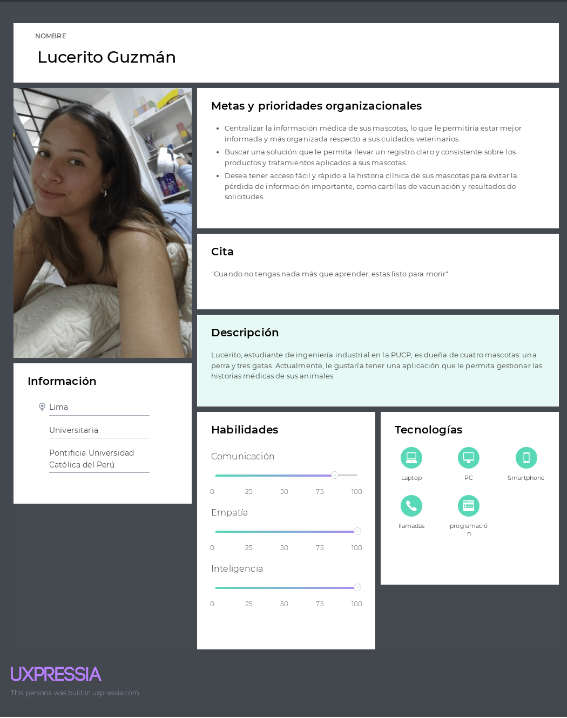

 
# **Universidad Peruana de Ciencias Aplicadas**
## Carrera de Ingeniería de Software

Ciclo: 2024 - 2

Curso: Desarrollo de Aplicaciones Open Source

Sección: SW56

Profesor: Efraín Ricardo Bautista Ubillús

“Informe TB1"
ddsax
Startup: LexMed

Producto: 

Grupo: 1

|          Integrantes          |      Código      |
|:-----------------------------:|:-------------------:|
|      |        |
|   fg  fdf df df   |        |
|     |       |
|Escobar Palomino , Sebastian Matias|u202125968|
|Ticona Panduro, Estrella del Pilar| u202210659|

    <strong>Agosto, 2024</strong>

 

<h1 align="center">Registro de versiones del Informe</h1>
 
<table>
        <thead>
            <tr>
                <th>Versión</th>
                <th>Fecha</th>
                <th>Autor</th>
                <th>Descripción de modificaciones</th>
            </tr>
        </thead>
        <tbody>
            <tr>
                <th>TB1</th>
                <td>20/08/2024</td>
                <td>
                    <ul>
          <li>integrante 1 </li>
          <li>integrante 2</li>
          <li>integrante 3</li>
          <li>integrante 4</li>
          <li>integrante 5</li>
                    <ul>
           </td>
      <td>            
             <ul>
          <li>Capítulo I: Introducción</li>
          <li>Capítulo II: Requirements Elicitation & Analysis</li>
          <li>Capítulo III: Requirements Specification</li>
          <li>Capítulo IV: Product Design</li>
          <li>Avance del Capítulo V: Product Implementation, Validation & Deployment hasta el punto 5.2.1.8</li>
          <li>Avance de Conclusiones, Bibliografía y Anexos</li>
        </ul>
      </td>
  </tr>
</tbody>
</table>

# Project Report Collaboration Insights

# Contenido
[Student Outcome](#student-outcome)

[Capítulo I: Introducción](#capitulo-i-introducción)
- [1.1. Startup Profile](#11-startup-profile)
  - [1.1.1. Descripción de la Startup](#111-descripción-de-la-startup)
  - [1.1.2. Perfiles de integrantes del equipo](#112-perfiles-de-integrantes-del-equipo)
- [1.2. Solution Profile](#12-solution-profile)
  - [1.2.1 Antecedentes y problemática](#121-antecedentes-y-problemática)
  - [1.2.2 Lean UX Process](#122-lean-ux-process)
    - [1.2.2.1. Lean UX Problem Statements](#1221-lean-ux-problem-statements)
    - [1.2.2.2. Lean UX Assumptions](#1222-lean-ux-assumptions)
    - [1.2.2.3. Lean UX Hypothesis Statements](#1223-lean-ux-hypothesis-statements)
    - [1.2.2.4. Lean UX Canvas](#1224-lean-ux-canvas)
- [1.3. Segmentos objetivo](#13-segmentos-objetivo)

[Capítulo II: Requirements Elicitation & Analysis](#capítulo-ii-requirements-elicitation--analysis)
- [2.1. Competidores](#21-competidores)
  - [2.1.1. Análisis competitivo](#211-análisis-competitivo)
  - [2.1.2. Estrategias y tácticas frente a competidores](#212-estrategias-y-tácticas-frente-a-competidores)
- [2.2. Entrevistas](#22-entrevistas)
  - [2.2.1. Diseño de entrevistas](#221-diseño-de-entrevistas)
  - [2.2.2. Registro de entrevistas](#222-registro-de-entrevistas)
  - [2.2.3. Análisis de entrevistas](#223-análisis-de-entrevistas)
- [2.3. Needfinding](#23-needfinding)
  - [2.3.1. User Personas](#231-user-personas)
  - [2.3.2. User Task Matrix](#232-user-task-matrix)
  - [2.3.3. User Journey Mapping](#233-user-journey-mapping)
  - [2.3.4. Empathy Mapping](#234-empathy-mapping)
  - [2.3.5. As-is Scenario Mapping](#235-as-is-scenario-mapping)
- [2.4. Ubiquitous Language](#24-ubiquitous-language)

[Capítulo III: Requirements Specification](#capítulo-iii-requirements-specification)
- [3.1. To-Be Scenario Mapping](#31-to-be-scenario-mapping)
- [3.2. User Stories](#32-user-stories)
- [3.3. Impact Mapping](#33-impact-mapping)
- [3.4. Product Backlog](#34-product-backlog)

[Capítulo IV: Product Design](#capítulo-iv-product-design)
- [4.1. Style Guidelines](#41-style-guidelines)
  - [4.1.1. General Style Guidelines](#411-general-style-guidelines)
  - [4.1.2. Web Style Guidelines](#412-web-style-guidelines)
- [4.2. Information Architecture](#42-information-architecture)
  - [4.2.1. Organization Systems](#421-organization-systems)
  - [4.2.2. Labeling Systems](#422-labeling-systems)
  - [4.2.3. SEO Tags and Meta Tag](#423-seo-tags-and-meta-tag)
  - [4.2.4. Searching Systems](#424-searching-systems)
  - [4.2.5. Navigation Systems](#425-navigation-systems)
- [4.3. Landing Page UI Design](#43-landing-page-ui-design)
  - [4.3.1. Landing Page Wireframe](#431-landing-page-wireframe)
  - [4.3.2. Landing Page Mock-up](#432-landing-page-mock-up)
- [4.4. Web Applications UX/UI Design](#44-web-applications-uxui-design)
  - [4.4.1. Web Applications Wireframes](#411-general-style-guidelines)
  - [4.4.2. Web Applications Wireflow Diagrams](#442-web-applications-wireflow-diagrams)
  - [4.4.3. Web Applications Mock-ups](#443-web-applications-mock-ups)
  - [4.4.4. Web Applications User Flow Diagrams](#444-web-applications-user-flow-diagrams)
- [4.5. Web Applications Prototyping](#45-web-applications-prototyping)
- [4.6. Domain-Driven Software Architecture](#46-domain-driven-software-architecture)
  - [4.6.1. Software Architecture Context Diagram](#461-software-architecture-context-diagram)
  - [4.6.2. Software Architecture Container Diagrams](#462-software-architecture-container-diagrams)
  - [4.6.3. Software Architecture Components Diagrams](#463-software-architecture-components-diagrams)
- [4.7. Software Object-Oriented Design](#47-software-object-oriented-design)
  - [4.7.1. Class Diagrams](#471-class-diagrams)
  - [4.7.2. Class Dictionary](#472-class-dictionary)
- [4.8. Database Design](#48-database-design)
  - [4.8.1. Database Diagram](#481-database-diagram)

[Capítulo V: Product Implementation, Validation & Deployment](#capítulo-v-product-implementation-validation--deployment)
- [5.1. Software Configuration Management](#51-software-configuration-management)
  - [5.1.1. Software Development Environment Configuration](#511-software-development-environment-configuration)
  - [5.1.2. Source Code Management](#512-source-code-management)
  - [5.1.3. Source Code Style Guide & Conventions](#513-source-code-style-guide--conventions)
  - [5.1.4. Software Deployment Configuration](#514-software-deployment-configuration)
- [5.2. Landing Page, Services & Applications Implementation](#52-landing-page-services--applications-implementation)
  - [5.2.X. Sprint n ](#52x-sprint)
    - [5.2.X.1. Sprint Planning n](#52x1-sprint-planning-n)
    - [5.2.X.2. Sprint Backlog n](#52x2-sprint-backlog-n)
    - [5.2.X.3. Development Evidence for Sprint Review](#52x3-development-evidence-for-sprint-review)
    - [5.2.X.4. Testing Suite Evidence for Sprint Review](#52x4-testing-suite-evidence-for-sprint-review)
    - [5.2.X.5. Execution Evidence for Sprint Review](#52x5-execution-evidence-for-sprint-review)
    - [5.2.X.6. Services Documentation Evidence for Sprint Review](#52x6-services-documentation-evidence-for-sprint-review)
    - [5.2.X.7. Software Deployment Evidence for Sprint Review](#52x7-software-deployment-evidence-for-sprint-review)
    - [5.2.X.8. Team Collaboration Insights during Sprint](#52x8-team-collaboration-insights-during-sprint)
- [5.3. Validation Interviews](#53-validation-interviews)
  - [5.3.1. Diseño de Entrevistas](#531-diseño-de-entrevistas)
  - [5.3.2. Registro de Entrevistas](#532-registro-de-entrevistas)
  - [5.3.3. Evaluaciones según heurísticas](#533-evaluaciones-según-heurísticas)
- [5.4. Video About-the-Product](#54-video-about-the-product)

[Conclusiones](#conclusiones)
- [Conclusiones y recomendaciones](#conclusiones-y-recomendaciones)
- [Video About-the-Team](#video-about-the-team)

[Bibliografía](#bibliografía)

[Anexos](#anexos)

# Student Outcome

# Capítulo I: Introducción
## 1.1. Startup Profile
### 1.1.1. Descripción de la Startup
### 1.1.2. Perfiles de integrantes del equipo
## 1.2. Solution Profile
### 1.2.1 Antecedentes y problemática
### 1.2.2 Lean UX Process
#### 1.2.2.1. Lean UX Problem Statements
#### 1.2.2.2. Lean UX Assumptions
#### 1.2.2.3. Lean UX Hypothesis Statements
#### 1.2.2.4. Lean UX Canvas
## 1.3. Segmentos objetivo

# Capítulo II: Requirements Elicitation & Analysis
## 2.1. Competidores
### 2.1.1. Análisis competitivo
### 2.1.2. Estrategias y tácticas frente a competidores
## 2.2. Entrevistas
### 2.2.1. Diseño de entrevistas
### 2.2.2. Registro de entrevistas
### 2.2.3. Análisis de entrevistas
## 2.3. Needfinding
### 2.3.1. User Personas
### 2.3.2. User Task Matrix
### 2.3.3. User Journey Mapping
### 2.3.4. Empathy Mapping
### 2.3.5. As-is Scenario Mapping
## 2.4. Ubiquitous Language

# Capítulo III: Requirements Specification
## 3.1. To-Be Scenario Mapping
## 3.2. User Stories
## 3.3. Impact Mapping
## 3.4. Product Backlog

# Capítulo IV: Product Design
## 4.1. Style Guidelines
### 4.1.1. General Style Guidelines
### 4.1.2. Web Style Guidelines
## 4.2. Information Architecture
### 4.2.1. Organization Systems
### 4.2.2. Labeling Systems
### 4.2.3. SEO Tags and Meta Tag
### 4.2.4. Searching Systems
### 4.2.5. Navigation Systems
## 4.3. Landing Page UI Design
### 4.3.1. Landing Page Wireframe
### 4.3.2. Landing Page Mock-up
## 4.4. Web Applications UX/UI Design
### 4.4.1. Web Applications Wireframes
### 4.4.2. Web Applications Wireflow Diagrams
### 4.4.3. Web Applications Mock-ups
### 4.4.4. Web Applications User Flow Diagrams
## 4.5. Web Applications Prototyping
## 4.6. Domain-Driven Software Architecture
### 4.6.1. Software Architecture Context Diagram
### 4.6.2. Software Architecture Container Diagrams
### 4.6.3. Software Architecture Components Diagrams
## 4.7. Software Object-Oriented Design
### 4.7.1. Class Diagrams
### 4.7.2. Class Dictionary
## 4.8. Database Design
## 4.8.1. Database Diagram

# Capítulo V: Product Implementation, Validation & Deployment
La implementación, validación y despliegue del producto son esenciales para asegurar que la visión del producto se convierta en una realidad funcional y accesible para nuestros usuarios. Estas etapas nos permiten transformar el diseño conceptual en una aplicación real, probada y lista para su uso, lo que nos ayuda a validar nuestras ideas, identificar posibles problemas y ofrecer una experiencia de usuario óptima.

## 5.1. Software Configuration Management
La gestión de la configuración del software es crucial para nuestro trabajo, ya que nos permite mantener un control preciso sobre los elementos de nuestro proyecto, como el código fuente, los documentos de diseño y los activos digitales. Esto garantiza que todos los miembros del equipo estén trabajando con la misma versión de los archivos y facilita la colaboración entre desarrolladores, diseñadores y otros profesionales involucrados en el proyecto.

### 5.1.1. Software Development Environment Configuration

- ### Project Management:
    * ### Trello:
      Una aplicación de gestión de proyectos que facilita el seguimiento de las tareas individuales de cada miembro del equipo de manera sencilla.  
      [Link De Registro o Inicio De Sesión](https://trello.com/es) 
      Imagen para mostrar evidencia de uso:
      
      *  ### Microsoft Teams
       una plataforma unificada de comunicación y colaboración que combina chat persistente en el lugar de trabajo, reuniones de video, almacenamiento de archivos e integración de aplicaciones.  
        [Link De Registro o Inicio De Sesión](https://www.microsoft.com/es-pe/)
      Imagen para mostrar evidencia de uso:
      

- ### Requirement Management:
    * ### Miro:
      Un sistema que ofrece una amplia gama de plantillas diseñadas para abordar diversos aspectos en la creación y gestión de proyectos.  
      [Link De Registro o Inicio De Sesión](https://miro.com/es/login/)
      Imagen para mostrar evidencia de uso:
      
    * ### UXPressia:
      Es una herramienta en línea que simplifica el proceso de mapeo y comprensión de las necesidades del cliente en un proyecto determinado.  
      [Link De Registro o Inicio De Sesión](https://uxpressia.com)
      Imagen para mostrar evidencia de uso:
      
    * ### Structurizr:
      Se trata de una suite de herramientas que posibilita la creación colaborativa de modelos C4 para representar de forma gráfica nuestros productos.  
      [Link De Registro o Inicio De Sesión](https://structurizr.com)
- ###  Product UX/UI Design:
    * ### Figma:
      Una herramienta de colaboración que facilita el desarrollo conjunto de wireframes y mockups.  
      [Link De Registro, Inicio De Sesión y Descarga](https://www.figma.com/downloads/)
    * ### LucidChart:
      Una herramienta colaborativa que posibilita la creación conjunta de wireframes flow y mockups flow.  
      [Link De Registro o Inicio De Sesión ](https://www.lucidchart.com/pages/es)
      Imagen para mostrar evidencia de uso:
      
- ###  Software Development:
    * ### HTML5:
      Es un lenguaje de etiquetado utilizado para crear la estructura a páginas web. Lo utilizamos para incluir componentes como texto, imágenes, enlaces, botones y videos en nuestras páginas web.  
      [Información Relacionada](https://www.esic.edu/rethink/tecnologia/html5-que-es-caracteristicas-y-como-funciona-c#:~:text=El%20HTML5%20es%20un%20estándar,%2C%20estilo%20de%20letra%2C%20etc.)
      Imagen para mostrar evidencia de uso:
      
    * ### CSS:
      Un lenguaje de diseño gráfico utilizado para dar formato y estilo a la presentación de un documento escrito en HTML.  
      [Información Relacionada](https://developer.mozilla.org/es/docs/Web/CSS)
      Imagen para mostrar evidencia de uso:
      
    * ### JavaScript:
      Un lenguaje de programación orientado a objetos dinámico que utilizamos para implementar funcionalidades en un documento HTML.  
      [Información Relacionada]( https://developer.mozilla.org/es/docs/Web/JavaScript )
      Imagen para mostrar evidencia de uso:
      
    * ### WebStorm:
      Un entorno de desarrollo integrado (IDE) que emplearemos para trabajar con JavaScript.  
      [Link De Descarga]( https://www.jetbrains.com/es-es/webstorm/)

- ###  Software Testing:
    * ### Lenguaje Gherkin:
      Se trata de un Lenguaje Específico de Dominio (DSL), diseñado específicamente para abordar un problema particular. Es un lenguaje comprensible para los desarrolladores, destinado a resolver necesidades concretas.  
- ###  Software Documentation:
    * ### Github:
      Se trata de una plataforma utilizada para el alojamiento de versiones del código fuente de un proyecto. Es una herramienta ampliamente popular en el trabajo colaborativo de programadores.  
      [Link De Descarga]( https://desktop.github.com)
      [Link De Registro o Inicio De Sesión](https://github.com/login)
- ###  Software Deployment:
    * ### GitHub Pages: 
      Una plataforma que posibilita la realización de despliegues simples directamente desde un repositorio de GitHub.  
      
### 5.1.2. Source Code Management

Landing Page Repository: [Landing Page Repository](https://github.com/los-seniors-v2/LandingPageFlexPal.git)
- #### GitFlow Implementation:
Para implementar el flujo de trabajo Gitflow utilizando Git como nuestra herramienta de control de versiones, nos basamos en la entrada de blog "A successful Git branching model" de Vincent Driessen. Esta referencia nos permitió establecer las convenciones detalladas que serán aplicadas en nuestro proyecto 

### **Master o Main branch**
La rama principal de desarrollo del proyecto es la Master branch. En esta rama reside el código que actualmente se encuentra en producción.
#### Notación: master o main

### **Develop branch**
La rama "Develop" albergará las más recientes actualizaciones y cambios agregados que serán incluidos en la próxima versión del proyecto. Esta rama sirve como un espacio para la integración y prueba continua de los cambios antes de ser fusionados con la rama principal "Master" para su despliegue en producción.
#### Notación: develop

### **Release branch**
La rama de lanzamiento (Release branch) facilitará la preparación de una nueva versión del producto. Esta rama permitirá la corrección de errores y permitirá que la rama Develop reciba más actualizaciones.
 Debe derivarse de la rama Develop.
 Debe fusionarse con la rama Develop y Master.
#### Notación: release

### **Feature branch**
Las ramas de características (Feature branches) serán empleadas para desarrollar nuevas funcionalidades o características del producto que se agregarán en la siguiente versión o en versiones futuras. Estas funcionalidades deberán fusionarse eventualmente con la rama Develop.
 Debe derivarse de la rama Develop.
 Debe fusionarse de vuelta a la rama Develop.
#### Notación: release

### **Hotfix branch**
La rama de corrección rápida (Hotfix branch) se empleará para resolver y actuar de manera inmediata ante posibles errores en la versión en producción del producto. La característica principal de esta rama es que permite preparar una solución rápida mientras el resto del equipo continúa trabajando en otras funcionalidades o mejoras.
 Debe derivarse de la rama Master
 Debe fusionarse con la rama Develop y Master
#### Notación: hotfix

### **Support branch**
### **Conventional Commits**
"Conventional Commits" es una convención para estructurar los mensajes de confirmación (commits) en un formato estándar y semántico. Este formato ayuda a comunicar claramente los cambios realizados en el código y facilita la generación de registros de cambios automáticos. Los "Conventional Commits" suelen seguir un formato que incluye un encabezado, un cuerpo opcional y un pie de página opcional, y se utilizan para describir de manera sucinta y clara los cambios realizados en el código, lo que facilita su seguimiento y comprensión por parte de los desarrolladores y otros miembros del equipo.
 
La estructura de un commit debe seguir las siguientes pautas:
~~~
git commit -m “<type>[optional scope]: <title>“ -m “<description”
~~~
**Tipos De Conventional Commits**
~~~
1. feat: Used to describe a new feature or functionality added to the code.
2. fix: Indicates a bug fix or solution to a problem.
3. docs: Employed for changes or improvements in code documentation.
4. style: Describes changes related to the code's formatting, such as whitespace, indentation, etc., that do not affect its functionality.
5. refactor: Used for modifications to the code that do not fix bugs or add new features, but rather improve its structure or readability.
6. test: Indicates the addition or modification of unit tests or functional tests.
7. chore: Used for changes in the build process or maintenance tasks that are not directly related to the code itself.
8. perf: Describes performance improvements in the code.
~~~

### 5.1.3. Source Code Style Guide & Conventions

Como norma general, se espera que todo el código desarrollado por los miembros del equipo esté completamente redactado en inglés.
- ### HTML 
    - #### Use Lowercase Element Names:
        Es recomendable utilizar minúsculas o lowercase para los nombres de los elementos HTML.
        ~~~ 
      <body>
            
This is a paragraph

      <body>
       ~~~
    - #### Close All HTML Elements:
        Es recomendable cerrar todos los elementos HTML correctamente.
        ~~~ 
      <body>
            
This is a paragraph

            
This is another paragraph

      <body>
       ~~~
    - #### Use Lowercase Attribute Names:
        Es recomendable utilizar minúsculas para los nombres de los atributos HTML.
      ~~~ 
      <a href="https://www.w3schools.com/html/">Visit our HTMLtutorial</a>
       ~~~
    - #### Always Specify alt, width, and height for Images:
      Es recomendable seguir estas convenciones en caso de que la imagen no se pueda mostrar, lo que ayuda a mejorar la accesibilidad del contenido.
      ~~~ 
      
      ~~~ 
    - #### Spaces and Equal Signs:
      Se recomienda no utilizar espacios en blanco entre las entidades para mejorar la legibilidad.
      ~~~ 
      <link rel="stylesheet" href="styles.css">
      ~~~ 
- ### CSS
    - #### ID and Class Naming
      Es recomendable utilizar nombres de clases e id's significativos que expresen claramente el propósito del elemento.
      ~~~ 
      #gallery {}
      #login {}
      .video {}
       ~~~
    - #### ID and Class Name Style
      Se recomienda utilizar nombres cortos para nombrar ids o clases, pero lo suficientemente descriptivos para entender su propósito.
      ~~~ 
      #nav {}
      .author {}
      ~~~
    - #### Shorthand Properties
      Se recomienda utilizar propiedades CSS de forma abreviada siempre que sea posible para hacer el código más eficiente y comprensible.
       ~~~ 
       border-top: 0;
       font: 100%/1.6 palatino, georgia, serif;
       padding: 0 1em 2em;
       ~~~ 
    - #### 0 and Units
      Es recomendable evitar especificar la unidad después del valor 0 en propiedades que lo permitan, ya que esto ayuda a reducir el tamaño del código y mejora su legibilidad.
       ~~~ 
       margin: 0;
       padding: 0;
       ~~~
     - #### Declaration Order
       Se recomienda ordenar las declaraciones en orden alfabético para facilitar el mantenimiento y la recordación del código.
       ~~~ 
        background: fuchsia;
        border: 1px solid;
        border-radius: 4px;
        color: black;
        text-align: center;
        text-indent: 2em;
       ~~~  
- ### JAVASCRIPT
     - #### Use expanded syntax
       Cada línea de JavaScript debería estar en una nueva línea, con la llave de apertura en la misma línea de su declaración y la llave de cierre en una nueva línea al final.
       ~~~ 
       function myFunc() {
        console.log('Hello!');
       };
       ~~~
     - #### Variable naming
       Para el nombre de las variables, se recomienda utilizar lowerCamelCase. 
       ~~~ 
       let playerScore = 0;
       let speed = distance / time;
       ~~~  
     - #### Declaring variables
       Para la declaración de variables, es recomendable utilizar las palabras reservadas let y const en lugar de var.
       ~~~ 
       const myName = 'Chris';
       console.log(myName);
       let myAge = '40';
       myAge++;
       console.log('Happy birthday!');
       ~~~ 
     - #### Function naming
       Para el nombre de las funciones, se recomienda utilizar lowerCamelCase.
       ~~~ 
       function sayHello() {
       alert('Hello!');
       };
       ~~~ 
- ### C#
    - #### PascalCase
      Mayúscula al principio de cada palabra para nombres de clases y métodos.
      ~~~ 
      public class MyClass {
          public void ExampleMethod() {
              // Method code
          }
      }
      ~~~
    - #### camelCase
      Minúscula al principio con mayúsculas para cada palabra subsiguiente para variables y parámetros.
      ~~~ 
      public class MyClass {
          public void ExampleMethod(int exampleNumber) {
              string exampleName = "Example";
              // Method code     
          }
      }
      ~~~
      - #### Reasonable line length
        Mantener líneas de código con longitud adecuada para mejorar la legibilidad.
        ~~~ 
        public class MyClass {
            public void ExampleMethod() {
                string message = "This is an example message that spans multiple lines " +
                                 "to demonstrate how to maintain a reasonable length.";
                 Console.WriteLine(message);  
          }
        }
        ~~~ 
      - #### Clear comments:
          Utilizar comentarios para explicar el propósito del código de manera concisa.
          ~~~ 
          public class MyClass {
              // This method performs an addition operation and returns the result.
              public int Add(int a, int b) {
                return a + b;
               }
          }
          ~~~
    - #### Single responsibility:
      Cada clase o método debe tener una única función bien definida.
      ~~~ 
      // Class responsible for handling basic mathematical operations
      public class MathematicalOperations {
          // Method to add two numbers
          public int Add(int a, int b) {
              return a + b; 
          } 
       
          // Method to subtract two numbers
          public int Subtract(int a, int b) { 
              return a - b; 
          } 
      }
      ~~~
- ### LENGUAJE GHERKIN
    - #### Descriptive and concise titles for scenarios
      Utilizar títulos descriptivos y concisos para los escenarios.
      ~~~ 
      Feature: Login
        Scenario: Successful login
          Given a user is on the login page     
          When they enter valid credentials     
          Then they should be logged in successfully      
      ~~~
    - #### Follow the Given-When-Then structure consistently.
      Seguir la estructura de Given-When-Then de manera consistente.
      ~~~ 
      Scenario: Adding items to the shopping cart
        Given the user is on the shopping page
        When they add an item to the cart
        Then the item should appear in the cart 
      ~~~
    - #### Focus on business-readable language
      Centrarse en un lenguaje legible para el negocio, evitando detalles técnicos de implementación.
      ~~~ 
      Scenario: Changing user settingst
        Given the user is logged in
        When they navigate to the settings page
        Then they should be able to update their profile
      ~~~
    - ####  Utilize Scenario Outline for scenarios with multiple similar cases.
      Utilizar Scenario Outline para escenarios con múltiples casos similares.
      ~~~ 
      Scenario Outline: Searching for products
        Given the user is on the search page
        When they search for "<product>"
        Then they should see search results for "<product>"
      
      Examples:
        | product  |
        | Laptop   |
        | Smartphone |
      ~~~
    - #### Add comments to provide additional context
      Agregar comentarios para proporcionar contexto adicional o explicaciones cuando sea necesario.
      ~~~ 
      # This scenario checks the functionality of the logout feature
      Scenario: User logout
        Given the user is logged in
        When they click on the logout button
        Then they should be redirected to the login page      
      ~~~
      
### 5.1.4. Software Deployment Configuration
- Creación Landing Page: 
1. Se crea un repositorio remoto en GitHub

2. Agregar a participantes

3. Habilitamos GitHub Pages en branch "master" y ruta "/(root)"

- Creación Front End App: 
1. Creación de repositorio dentro de nuestra organización

2. Agregar a participantes

## 5.2. Landing Page, Services & Applications Implementation

### 5.2.X. Sprint 

#### 5.2.X.1. Sprint Planning n

#### 5.2.X.2. Sprint Backlog n

#### 5.2.X.3. Development Evidence for Sprint Review

#### 5.2.X.4. Testing Suite Evidence for Sprint Review

#### 5.2.X.5. Execution Evidence for Sprint Review

#### 5.2.X.6. Services Documentation Evidence for Sprint Review

#### 5.2.X.7. Software Deployment Evidence for Sprint Review

#### 5.2.X.8. Team Collaboration Insights during Sprint
Durante el transcurso de este sprint, todos participamos de forma activa y constante en la creación de las tareas asignadas. Presentamos evidencia de los progresos individuales:

# Conclusiones
## Conclusiones y recomendaciones
## Video About-the-Team.

# Bibliografía

# Anexos
