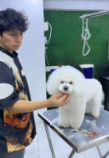

# **1. Capítulo I: Introducción**
   ## **1.1. Startup Profile**
  ### **1.1.1. Descripción de la Startup**
"Ez.vet" es una plataforma completa diseñada para gestionar la administración veterinaria y visualizar historiales clínicos. Su principal propósito es simplificar y mejorar la gestión de diferentes aspectos del cuidado de mascotas, abarcando la administración de usuarios, clientes, productos, y servicios, así como la organización de los historiales clínicos. La meta es ofrecer una herramienta que ayude tanto a los dueños de mascotas como a los veterinarios en el manejo de la información y las tareas cotidianas.
### **1.1.2. Perfiles de integrantes del equipo**

|                    Photo                        |                                                                                                                                                                                                                                                                                                    Description                                                                                                                                                                                                                                                                                                    |
| :------------------------------------------------: | :---------------------------------------------------------------------------------------------------------------------------------------------------------------------------------------------------------------------------------------------------------------------------------------------------------------------------------------------------------------------------------------------------------------------------------------------------------------------------------------------------------------------------------------------------------------------------------------------------------------: |
| Bastidas Bastidas, Diego Martin   |                                                                         Soy estudiante del 6to ciclo de la carrera de Ingeniería de Software. Decidí estudiar esta carrera porque desde pequeño me llamaba la atención el funcionamiento de una computadora y los procesos que conlleva. Me gusta practicar deportes de contacto, salir a pasear y sobre todo me encanta ser Groomer canino y trabajar con mascotas.                                                                                                                         |
| Bottger Salazar, Jhoan Karl   | Soy Johan Bottger, estoy en mi sexto ciclo de la carrera Ingeniería de Software en la UPC. Tengo conocimientos en los lenguajes C++, Python, JavaScript y HTML. Tengo gran interés en las metodologías ágiles por lo que en un futuro quisiera dedicarme a su implementación.                                                                         |
| De Las Casas Latour, Sebastian   | Mi nombre es Sebastián De Las Casas y tengo 19 años. Actualmente estoy cursando la carrera de Ingeniería de Software en la UPC. Me considero una persona paciente, optimista y que se maneja bien bajo presión. Como miembro del equipo me esforzaré en apoyar en todo lo que pueda al avance del trabajo. |
| Escobar Palomino, Sebastian Matias   |                                                                                                                              Como estudiante de ingeniería de software, me comprometo a contribuir al máximo en el grupo y a cumplir con las entregas dentro del plazo establecido, manteniendo una comunicación efectiva con mis compañeros y aplicando mis habilidades para desarrollar las tareas asignadas en este proyecto.                                                                                                                             |
|  Ticona Panduro, Estrella del Pilar     |                                                                                                                                                                                                actualmente estudio  la carrera de Ingeniería de Software en UPC. Opté por estudiar esta carrera porque me interesa programar y crear diferentes aplicativos o programas y emplearlo en la salud. En mis tiempos libres me gusta ver series o películas. Mi compromiso es aportar ideas innovadoras a lo largo del curso, en especial en las tareas en equipo. Mis habilidades son tener una actitud positiva, entusiasta y responsable.                                                                                                                                                                                                |

## **1.2. Solution Profile**
Ez.vet es una aplicación creada específicamente para clínicas veterinarias, enfocada en la gestión interna de sus operaciones y en facilitar el acceso a la información clínica para los dueños de mascotas. Esta herramienta no solo permite a los veterinarios organizar y manejar de manera más eficiente los historiales clínicos de sus pacientes, sino que también ofrece funciones para gestionar recordatorios, controlar inventarios y realizar otras tareas cruciales para el funcionamiento de la clínica. 

La interfaz de Ez.vet está diseñada para ser intuitiva y fácil de usar, lo que facilita a los veterinarios llevar un control preciso y detallado de cada aspecto de su práctica sin complicaciones. Además, la aplicación incluye una función adicional que permite publicar los historiales clínicos para que los dueños de las mascotas puedan acceder a ellos en cualquier momento. Esto asegura que los propietarios estén siempre informados sobre la salud de sus mascotas y puedan consultar los detalles médicos cuando lo deseen, mejorando la comunicación y la transparencia entre la clínica y sus clientes.
### **1.2.1. Antecedentes y problemática**
**What**

`		`**¿Cuál es el problema?**

`	`El problema reside en la falta de una aplicación que sea intuitiva y sencilla de usar en el entorno veterinario, y que, al mismo tiempo, permita integrar y gestionar de manera eficiente los diversos aspectos que involucra esta práctica.

**When**	

`		`**¿Cuándo sucede el problema?**

`	`El problema se presenta cuando las clínicas veterinarias no cuentan con una aplicación intuitiva y fácil de usar, lo que complica la integración y gestión eficiente de los distintos aspectos necesarios para su operación diaria.

**Where**

`		`**¿Dónde sucede el problema?**

`	`El problema se manifiesta en las clínicas veterinarias, donde la ausencia de una aplicación dificulta la integración y gestión de las diversas áreas esenciales para su funcionamiento. Esto no solo afecta el trabajo diario de los veterinarios, sino que también repercute en los dueños de mascotas, quienes requieren una forma sencilla de acceder a la información y los servicios relacionados con la salud de sus animales.

**Why**

`		`**¿Por qué sucede el problema?**	

`	`El problema radica en la falta de aplicaciones específicamente diseñadas para satisfacer las complejas y variadas necesidades de una clínica veterinaria. Aunque existen muchas aplicaciones, estas no son lo suficientemente flexibles o completas para cubrir todos los aspectos necesarios, como la gestión de historiales clínicos, el control de inventarios y la comunicación con los dueños de las mascotas. Esto genera dificultades tanto para los veterinarios, quienes se ven obligados a recurrir a múltiples herramientas o procesos manuales, como para los propietarios de mascotas, que enfrentan limitaciones en el acceso a información relevante.

**Who**

`		`**¿Qué llevara a las personas a usar nuestro producto?**

Las personas elegirán Ez.vet por la facilidad con la que podrán completar los campos requeridos, la amplia visibilidad que la aplicación tendrá en redes sociales, y, sobre todo, por lo sencillo que es llenar las historias clínicas sin la molestia de tener que cumplir con campos obligatorios.

**How**

`		`**¿En qué condiciones los clientes usaran nuestro producto?**

`	`Los clientes recurrirán a nuestro producto cuando necesiten una solución eficiente y fácil de usar para gestionar las operaciones de su clínica veterinaria. Esto abarca escenarios en los que buscan una herramienta que simplifique la administración de historiales clínicos, controle el inventario, y facilite la comunicación con los dueños de mascotas. Además, lo utilizarán cuando necesiten una aplicación que les permita acceder y compartir información médica de manera rápida y sin complicaciones, especialmente en un entorno donde el tiempo y la precisión son fundamentales.

**How Much**

` `Los clientes recurrirán a nuestro producto cuando necesiten una solución eficiente y fácil de usar para gestionar las operaciones de su clínica veterinaria. Esto abarca escenarios en los que buscan una herramienta que simplifique la administración de historiales clínicos, controle el inventario y facilite la comunicación con los dueños de mascotas. Además, lo utilizarán cuando necesiten una aplicación que les permita acceder y compartir información médica de manera rápida y sin complicaciones, especialmente en un entorno donde el tiempo y la precisión son fundamentales.

### ` `**1.2.2. Lean UX Process**
  #### **1.2.2.1. Lean UX Problem Statements**
La aplicación Ez.vet está diseñada para abordar la necesidad de una herramienta integral que simplifique la gestión diaria en las clínicas veterinarias. Con una interfaz intuitiva y fácil de usar, la aplicación busca eliminar las complicaciones y dificultades relacionadas con la administración de diversos aspectos de la práctica veterinaria en un solo lugar, permitiendo que tanto veterinarios como dueños de mascotas accedan de manera rápida y sencilla a la información relevante.
#### **1.2.2.2. Lean UX Assumptions**
Sobre el producto:

1. ¿Quién es el usuario?

   Los usuarios principales de la aplicación son, por un lado, las clínicas veterinarias, que utilizan la plataforma para gestionar sus operaciones diarias, y por otro lado, los dueños de mascotas, quienes acceden fácilmente a la información médica y los servicios de la clínica.

1. ¿Dónde encaja la aplicación en su vida?

   La aplicación se incorpora en la rutina diaria de las clínicas veterinarias y en el cuidado diario de las mascotas, simplificando su tratamiento y atención.

1. ¿Qué problemas tienen nuestros usuarios y como se puede resolver?

   Los usuarios enfrentan la carencia de una aplicación especializada para la gestión completa de clínicas veterinarias y la falta de un portal accesible para consultar la historia clínica de una mascota. Nuestra aplicación aborda estos problemas al ofrecer una plataforma única que permite administrar todos los aspectos de la clínica y facilita el acceso a la información médica.

1. ¿Dónde y cuándo es usada nuestra aplicación?

   La aplicación se emplea principalmente en clínicas veterinarias. Los momentos clave para su uso incluyen durante las consultas veterinarias y cuando los dueños de mascotas optan por cambiar de veterinario y necesitan transferir el historial clínico o el registro de vacunas a una nueva clínica.

1. ¿Qué características son importantes?

   Las características clave abarcan una interfaz intuitiva que funcione en dispositivos móviles, computadoras y laptops. También es fundamental eliminar campos innecesarios u obligatorios que puedan complicar el proceso de registro.

1. ¿Cómo debe verse nuestra aplicación y como debe comportarse?

   Las características principales incluyen una interfaz fácil de usar en dispositivos móviles, computadoras y laptops. Además, es esencial eliminar campos innecesarios o obligatorios que puedan complicar el proceso de registro.

   #### **1.2.2.3. Lean UX Hypothesis Statements**

**Creemos** que si diseñamos una aplicación intuitiva que permita a los veterinarios gestionar historiales clínicos y recordatorios de manera eficiente

**Sabremos** que hemos tenido éxito cuando observemos un aumento en la eficiencia operativa y una reducción en el tiempo dedicado a tareas administrativas en las clínicas veterinarias

**Cuando** las clínicas adopten nuestra aplicación y reporten mejoras en su flujo de trabajo diario, habremos validado nuestra hipótesis.

**Creemos** que al ofrecer una plataforma que facilite el acceso a la historia clínica de las mascotas para los dueños

**Sabremos** que nuestra solución es efectiva cuando recibamos comentarios positivos de los usuarios sobre la facilidad de acceso y la utilidad de la información médica compartida

**Cuando** los dueños de mascotas utilicen la aplicación para consultar y manejar la salud de sus animales sin problemas, habremos confirmado que estamos resolviendo una necesidad real

**Creemos** que si eliminamos los campos obligatorios innecesarios y simplificamos el proceso de registro en la aplicación

**Sabremos** que hemos logrado nuestro objetivo cuando los usuarios experimenten una mayor satisfacción y una reducción en los errores de entrada de datos

**Cuando** tanto veterinarios como propietarios de mascotas reporten una experiencia de usuario fluida y sin frustraciones, habremos validado que nuestra aplicación cumple con las expectativas de simplicidad y funcionalidad.

#### **1.2.2.4. Lean UX Canvas**

Problem Statement:

`   `- Qué: Falta de una aplicación intuitiva para gestionar las diversas operaciones de las clínicas veterinarias.

`   `- Cuándo: Cuando las clínicas veterinarias carecen de una herramienta que integre y gestione eficientemente las áreas esenciales de su operación.

`   `- Dónde: Clínicas veterinarias que requieren una solución centralizada.

`   `- Por qué: Las aplicaciones existentes no son lo suficientemente flexibles para cubrir todas las necesidades como la gestión de historiales clínicos, control de inventarios y comunicación con los dueños de mascotas.

Assumptions

`   `- Los usuarios principales son las clínicas veterinarias y los dueños de mascotas.

`   `- La aplicación se utiliza en la rutina diaria de las clínicas para gestionar operaciones y facilitar el acceso a la información por parte de los dueños.

`   `- Los problemas clave que enfrenta el usuario incluyen la falta de una plataforma integrada y la dificultad de acceder a información clínica.

Hypothesis

`   `- Creemos que diseñar una aplicación intuitiva que permita a los veterinarios gestionar historiales clínicos y recordatorios aumentará la eficiencia operativa y reducirá el tiempo dedicado a tareas administrativas.

`   `- Sabremos que hemos tenido éxito cuando observemos mejoras en el flujo de trabajo diario de las clínicas y comentarios positivos de los usuarios.

Users & Customers

`   `- Segmento 1: Clínicas veterinarias que buscan optimizar su gestión operativa.

`   `- Segmento 2: Dueños de mascotas que necesitan acceso rápido y eficiente a la información médica de sus mascotas.

User Benefits

`   `- Simplificación y centralización de la gestión clínica.

`   `- Acceso fácil y rápido a la información de salud de las mascotas.

Business Outcomes

`   `- Mayor confianza en la gestión clínica.

`   `- Reducción de errores y tiempos de espera en la administración.

What's the most important thing we need to learn first?

`   `- Validar que la aplicación mejora la eficiencia y satisface las necesidades de los usuarios (clínicas y dueños de mascotas).

What's the least amount of work we need to do to learn the next most important thing?

`   `- Realizar encuestas y pruebas de uso con clínicas veterinarias y dueños de mascotas para obtener retroalimentación temprana.
## **1.3. Segmentos Objetivos**
   ***Segmentos Objetivo 1 – Clínicas Veterinarias***

   Este segmento está compuesto por clínicas veterinarias de todos los tamaños, desde pequeñas prácticas hasta grandes centros veterinarios con múltiples especialistas. Las clínicas veterinarias modernas enfrentan la necesidad de mejorar la eficiencia en la gestión de sus operaciones diarias, ya que suelen manejar grandes volúmenes de información médica de distintas mascotas, además de gestionar inventarios, citas y relaciones con los dueños de las mascotas.

   Actualmente, muchas clínicas siguen utilizando métodos manuales, hojas de cálculo o sistemas de gestión que no están completamente adaptados a las necesidades del sector veterinario. Esto genera ineficiencias operativas que afectan la productividad del personal y la experiencia de los clientes, incrementando el tiempo de espera y los errores en la documentación.

   ***Segmentos Objetivo 2 – Dueño de Mascotas*** 

   Este segmento está formado por dueños de mascotas que buscan soluciones fáciles y convenientes para gestionar la salud de sus animales. Muchos de ellos son propietarios jóvenes y tecnológicos que ya están acostumbrados a utilizar aplicaciones móviles para gestionar varios aspectos de su vida diaria, y ven con buenos ojos el uso de herramientas digitales para el cuidado de sus mascotas. Sin embargo, también incluye a dueños de mascotas que pueden no estar tan familiarizados con la tecnología pero que buscan una forma más sencilla de gestionar toda la información relacionada con la salud de sus animales.
